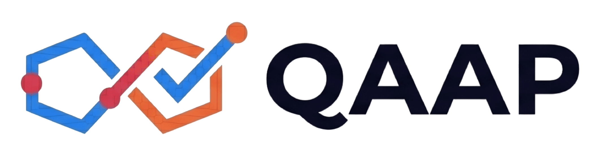

<p align="center">
  &nbsp;&nbsp;&nbsp;&nbsp;<strong>|</strong>&nbsp;&nbsp;&nbsp;&nbsp;
</p>

<h1 align="center">QAAP &mdash; QA Automation Platform</h1>

<p align="center">
  <strong>AI-powered E2E test generation for enterprise QA teams</strong><br/>
  Research workspace + multi-tenant SaaS product by <a href="https://nfq.es">NFQ</a>
</p>

<p align="center">
  
  
  
  
  
  
  
</p>

---

## What is this

This monorepo contains **two products** and the **research foundation** that drives every design decision:

| Product | Path | What it does |
|---------|------|-------------|
| **qa-framework** | [`qa-framework/`](qa-framework/) | Skill-first framework for automatic E2E test generation with Playwright + LLM. Consumed as Claude Code skills (`.md` files copied to `.claude/commands/`). No binary, no runtime, no dependencies. |
| **QAAP** | [`qaap/`](qaap/) | Multi-tenant SaaS that productizes the framework's pipeline into a web app with connectors, multi-LLM orchestration, proposal review, and test plan management. |

QAAP enables QA experts to automate the creation and maintenance of end-to-end test plans using LLMs. Instead of replacing QA teams, it **amplifies their expertise** — combining human judgment with AI-powered test generation, review, and execution.

---

## How it works

```
   Connectors                    LLM Pipeline (5 steps)              Human-in-the-loop
 ┌────────────┐         ┌──────────────────────────┐          ┌──────────────────────┐
 │  GitHub    │         │  1. Collect raw chunks   │          │  Browse features     │
 │  Jira      │────────►│  2. Extract features     │─────────►│  Review scenarios    │
 │  OpenAPI   │  data   │  3. Extract test areas   │ proposal │  Edit Gherkin        │
 │  Documents │  sources│  4. Generate Gherkin     │  tree    │  Adjust confidence   │
 │  Figma     │         │  5. Assemble proposal    │          │  Accept / reject     │
 └────────────┘         └──────────────────────────┘          └──────────┬───────────┘
                                                                         │ accept
                                                               ┌─────────▼───────────┐
                                                               │  Test Plans +       │
                                                               │  Gherkin Scenarios  │
                                                               │  (with confidence   │
                                                               │   + rationale)      │
                                                               └─────────────────────┘
```

Every generated scenario carries a **confidence score** (0.0-1.0) and a **rationale** explaining why. Routing thresholds: `>=85%` auto-accept, `60-84%` human review, `<60%` manual.

---

## Repository structure

```
.
├── research/                        Consolidated research foundation
│   ├── insights.md                     27 key findings cited by every ADR
│   ├── patterns.md                     13 recurring patterns across 2+ sources
│   └── client-signals.md              9 sanitized market signals from enterprise engagements
│
├── news/                            Article processing pipeline
│   ├── feeds.md                        RSS sources (Medium tags, industry blogs)
│   ├── paywall-workflow.md             How to get paywalled content into the repo
│   ├── inbox/                          13 processed article summaries (2022-2026)
│   └── inbox/raw/                      Drop zone for raw downloads (.md/.pdf)
│
├── references/                      External repos studied (conceptual anchors, no code cloned)
│
├── clients/                         Client engagement transcripts (gitignored, local-only)
│
├── qa-framework/                    The framework product (design docs, not executable code)
│   ├── architecture/                   3 ADRs (framework form, Playwright setup, OpenAPI-driven)
│   ├── protocol/                       Generation protocol v0.1 + prompt templates
│   ├── parsers/                        4 parser specs (source-code, openapi, jira, test-conventions)
│   ├── targets/                        Target project validation sequence
│   └── validation/                     XRay reporter + verify pipeline
│
└── qaap/                            The SaaS product
    ├── spa/                            React 19 SPA (77 components, 5 domains)
    ├── backend/                        22 Deno Edge Functions + 20 PostgreSQL migrations
    ├── engine/                         LLM pipeline worker — 5-step design + 2 validated PoC runs
    ├── documentation/                  8 product specs, 17 ADRs, 7 scaffolding skills
    └── prototypes/                     9 branded HTML demos (Iberia, Booking, Ferrovial, Sacyr...)
```

---

## Design principles

These are **load-bearing constraints** validated across 27 research insights and 13 patterns — not aspirational guidelines. Each one traces to concrete research entries and has been cross-validated with client signals.

| Principle | What it means | Key sources |
|-----------|--------------|-------------|
| **Properties over content** | Assert on structural properties (visible, count, enabled), never literal text. "Score, don't assert." | Kshirsagar 3 Pipelines, PromptFoo, Garvanand, ElAmir, Amrutalohabare |
| **Static analysis first** | Justify each LLM use against a deterministic alternative. Parsers use AST/grep when possible. | Kastner postmortem, Sanaev MCP |
| **Build-time vs run-time** | Skills/MCP for exploration (build-time), Playwright CLI for CI (run-time). Never couple them. | Sanaev, Kastner, ADR-001 |
| **Confidence + rationale** | Every LLM output carries `{result, confidence, rationale}`. Decisions routed by threshold. | Kshirsagar 3 Agents, Garvanand trajectory eval |
| **Local-first** | Must run with local models (Ollama + LM Studio). OpenAI-compatible API as portability layer. | Kshirsagar local pipeline |
| **Strict convention contracts** | Prohibitive rules ("PROHIBITED", "ONLY") produce ~95% LLM compliance vs ~70% for descriptive guidelines. | Nesvitii AGENTS.md pattern |
| **Normalisation step** | Freeform input (Jira, docs) gets a dedicated cheap LLM call to normalize before the main pipeline. | Nesvitii, Kshirsagar |
| **Observation-based debug** | Debug loop uses screenshot + DOM state as evidence, not inference from error messages. | Nesvitii, Singh RAG |
| **No SDK lock-in** | All LLM calls via standard `/v1/chat/completions`. No provider-specific SDKs. | Pattern: OpenAI-compatible API |
| **3-layer decomposition** | Audit/discover -> transform/generate -> validate/regression. Three specialized stages, not one monolithic agent. | Kshirsagar, Kastner, Pattnaik |

---

## QAAP — The SaaS product

### Tech stack

| Layer | Technology |
|-------|-----------|
| Frontend | React 19, Vite 8, TypeScript 6, MUI v9, TanStack Router + Query v5, i18next, react-markdown |
| Backend | Supabase Edge Functions (Deno 2), `@supabase/supabase-js` |
| Database | PostgreSQL 17 with RLS, PostgREST disabled, multi-tenant via `tenant_id` |
| Auth | Supabase Auth (Google OAuth), auto-profile trigger on signup |
| Engine | Node.js worker (Docker), polls pgmq queue, OpenAI-compatible LLM API |
| LLM | OpenAI-compatible API via fetch — supports Anthropic, OpenAI, Google, Ollama, LiteLLM |
| Deployment | Vercel (SPA) + Supabase (backend + database) |
| Code quality | ESLint 10, Prettier, Husky + lint-staged, Vitest, Testing Library |

### SPA architecture

The frontend follows **Vertical Slice Architecture** — each domain owns its features end-to-end. 77 `.tsx` components across 5 domains + a shared layer.

| Domain | Features | Description |
|--------|----------|-------------|
| `dashboard` | Home, activity feed, quick actions | Overview with stat cards, recent plans, and execution history |
| `engine` | Pipeline list, engine run, proposal review | Monitor LLM pipeline runs in real-time, review generated proposals with Gherkin editing |
| `knowledge-base` | Connector list, bucket/repo management | Configure data sources (GitHub repos, Supabase Storage buckets), test credentials |
| `settings` | LLM providers, model matrix | Multi-provider LLM configuration with per-task model routing |
| `test-plans` | Plan list, plan detail, scenario editing | Manage test plans, edit Gherkin scenarios, 3 layout modes (standard, IDE, AI-first) |

**Shared layer:** `auth/` (guards, login), `components/` (12 reusable UI), `config/` (Supabase client), `hooks/`, `i18n/`, `layout/` (app shell, sidebar), `tenant/` (multi-tenant context + branding), `theme/` (MUI customization), `utils/` (format helpers, project colors).

### Backend architecture

**22 Deno Edge Functions** grouped by concern, all following the same pattern: `Deno.serve()` -> CORS preflight -> auth check -> tenant resolution -> business logic -> standardized response.

| Group | Functions | Description |
|-------|-----------|-------------|
| Auth & profile | `get-profile`, `update-avatar`, `get-tenants` | User session, avatar management, tenant listing (superadmin) |
| Connectors | `get-connectors`, `create-connector`, `update-connector`, `delete-connector`, `test-connector` | CRUD + credential validation for data source integrations |
| LLM providers | `get-llm-providers`, `create-llm-provider`, `update-llm-provider`, `delete-llm-provider`, `test-llm-provider`, `update-model-matrix` | CRUD + connectivity test + per-task model routing matrix |
| Engine | `create-engine-job`, `get-engine-job`, `list-engine-jobs`, `accept-proposal` | Pipeline job lifecycle: create -> monitor -> accept proposal -> materialize |
| Test plans | `list-test-plans`, `get-test-plan`, `update-scenario` | Test plan and scenario management |

**Shared modules** (`_shared/`): `auth.ts` (JWT + tenant resolution + role gating), `cors.ts` (explicit origin allowlist, pentest-hardened), `response.ts` (standardized helpers), `client.ts` (per-request Supabase clients), `tenant.ts` (multi-tenant context), `url-safety.ts` (SSRF protection), `engine-jobs.ts`, `connectors/` (GitHub + Supabase Storage), `llm-providers/` (DTOs).

### Database

PostgreSQL 17 with Row-Level Security. **PostgREST is disabled** — all data access goes through Edge Functions using a service-role client.

| Table | Purpose |
|-------|---------|
| `tenants` | Tenant config (slug, name, branding JSONB, LLM model matrix) |
| `user_profiles` | Users linked to tenants (role: superadmin / admin / editor / viewer) |
| `connector_configs` | Data source connections (GitHub, Supabase Storage, etc.) |
| `llm_provider_configs` | LLM provider settings (Anthropic, OpenAI, Google, Ollama, LiteLLM) |
| `engine_jobs` | Pipeline execution instances (status, selected sources, creator) |
| `engine_job_steps` | 5 steps per job with typed JSONB input/output contracts |
| `test_plans` | Materialized test plans (from accepted proposals) |
| `test_scenarios` | Gherkin scenarios with confidence, rationale, category, review status |
| `context_sources` | Links plans back to connector data they were derived from |
| `prompt_logs` | Every LLM call logged (non-negotiable NFR) |

**Multi-tenancy model:**
- Every table has a `tenant_id` column with RLS policies enforcing isolation
- Superadmins have nullable `tenant_id` and can override context via `x-tenant-id` header
- Auto-profile trigger on `auth.users` insert — `@nfq.es` emails get superadmin automatically
- 20 migrations covering: initial schema, superadmin role, connector configs, engine jobs + steps + pgmq queue, LLM providers, domain tables

### Security posture

- **CORS:** explicit origin allowlist (no wildcards), hardened after penetration test
- **Framing protection:** X-Frame-Options: DENY + CSP frame-ancestors on every response
- **SSRF protection:** upstream URL validation with private IP detection and protocol checks
- **Credential isolation:** API keys/tokens stripped from all DTO responses (`hasApiKey: !!row.api_key`)
- **PostgREST disabled:** migration 0006 revokes all schema access from anon/authenticated roles
- **URL validation:** avatar URLs restricted to HTTPS-only; Supabase Storage hosts restricted to `.supabase.co` / `.supabase.in`
- **GitHub API:** version header pinned

---

## Engine pipeline

The engine is a standalone Node.js/Docker process that processes `engine_jobs` through **5 typed steps** autonomously. Each step has strict JSONB input/output contracts — output of step N feeds as input to step N+1.

| Step | Name | Type | What it does | Output |
|------|------|------|-------------|--------|
| 1 | `collect` | LLM agent + tools | Autonomously explores data sources (GitHub, Jira, Figma), gathers raw structural data | 20-35 raw chunks (file trees, routes, types, configs) |
| 2 | `extract_features` | Single LLM call | Identifies high-level user-facing features from all chunks | 5-15 features with confidence + rationale |
| 3 | `extract_plans` | Parallel (1 per feature) | Breaks each feature into independent testable areas | 3-6 test areas per feature |
| 4 | `extract_scenarios` | Parallel (1 per area) | Generates Gherkin scenarios with strict E2E rules | Scenarios with Background, property-based assertions |
| 5 | `generate_proposal` | Pure aggregation (no LLM) | Nests everything into a tree, computes stats, flags coverage gaps | Proposal tree for human review |

**Flow:** Job created -> enqueued via pgmq -> engine polls -> runs steps 1-5 autonomously -> pauses at proposal -> user reviews in SPA -> accepts -> Edge Function materializes into domain tables.

**Prompt templates:** 5 detailed prompt files in [`engine/prompts/`](qaap/engine/prompts/) (350-line collector agent, 220-line feature extraction, 190-line test area extraction, 300-line scenario generation with 22 strict rules, 155-line proposal assembly).

### Validated PoC runs

| Project | Domain | Chunks | Features | Test Areas | Scenarios | Avg Confidence |
|---------|--------|--------|----------|------------|-----------|---------------|
| **clau-lessons** | Education app | 23 | 12 | 59 | 26 (2/59 areas) | 0.886 |
| **waveconomy** | B2B credit-risk SaaS | 30 | 14 | 94 | 68 (8/94 areas) | 0.888 |

The waveconomy run discovered and fixed the **ID collision bug** (parallel subagents generating duplicate local IDs), leading to the orchestrator-minted global ID pattern.

---

## qa-framework — The skill-first framework

Delivered as Claude Code skills (`.md` files) — no binary, no runtime, no dependencies. All design is research-driven.

### Generation protocol (v0.1)

```
1. PARSE SOURCE CODE        ->  testIds, interactions, routes, API calls
2. PARSE OPENAPI (opt.)     ->  endpoints, schemas, error states
3. PARSE JIRA (opt.)        ->  acceptance criteria, user role, feature scope
4. PARSE CONVENTIONS (opt.) -> strict contract from existing tests
5. ASSEMBLE CONTEXT         ->  combine all parser outputs into a structured prompt
6. GENERATE SPEC            ->  Playwright E2E spec with property-based assertions
7. VERIFY                   ->  lint + type-check + compile + (optional) run against mock server
```

### 4 parsers

| Parser | Input | Method | LLM? |
|--------|-------|--------|------|
| **Source Code** | Component/feature path | AST + grep (testIds, interactions, routes) | No |
| **OpenAPI** | Backend YAML/JSON spec | Schema parsing (endpoints, response schemas, error codes) | No |
| **Jira/Story** | Ticket key | Freeform text normalisation | Yes (classification, cheap) |
| **Test Conventions** | Existing `e2e/` directory | Pattern extraction (strict convention contract) | No |

### Framework ADRs

| ADR | Decision |
|-----|----------|
| [ADR-001](qa-framework/architecture/adr-001-framework-form.md) | Framework consumed as Claude Code skills (skill-first), not CLI or MCP server |
| [ADR-002](qa-framework/architecture/adr-002-playwright-setup.md) | Playwright as the target test framework |
| [ADR-003](qa-framework/architecture/adr-003-openapi-driven.md) | OpenAPI spec as a first-class input for endpoint-aware test generation |

---

## Research foundation

**Every design decision traces back to a research entry.** Without a trace, it doesn't go into the framework or QAAP. This is not a formality — it's how we avoid "vibes-based architecture".

```
news/ + references/  ──►  research/insights.md   ──►  qa-framework/ ADRs + specs
                          research/patterns.md         qaap/ architecture
clients/ (gitignored) ──► research/client-signals.md
```

### Numbers

| Layer | Count |
|-------|-------|
| Articles analyzed | 13 (2022-2026) |
| Distilled insights | 27 |
| Recurring patterns (2+ sources) | 13 |
| Client signals (sanitized) | 9 |
| Framework ADRs | 3 |
| QAAP ADRs | 17 |
| Product spec documents | 8 |

### Articles analyzed

| Date | Author | Title | Key contribution |
|------|--------|-------|-----------------|
| 2022-01 | Kapoor | Testing Automation, What are Pyramids and Diamonds? | Non-LLM conceptual anchor: pyramid/inverted/diamond topologies |
| 2026-02 | Kastner | I replaced my entire QA team with Claude | Postmortem: regression vs exploratory thesis, crawl/plan/execute |
| 2026-04 | Nesvitii | MCP + Playwright + Jira: Full E2E Automation | **Full ticket-to-PR pipeline.** AGENTS.md pattern, normalisation, DOM-grounded debug |
| 2026-05 | Kshirsagar | 3 Pipelines. 14 Days. 0 -> 500 AI Test Assertions | **Conceptual unlock: properties over content.** 3-layer architecture |
| 2026-05 | Kshirsagar | 4 Metrics. 1 Week. PromptFoo Setup for SDETs | Ground-truth dataset construction, PromptFoo + 4 metrics |
| 2026-05 | Kshirsagar | 3 Agents. 12 Days. Legacy XPath -> Smart Locators | 3-agent architecture + confidence-based routing |
| 2026-05 | Kshirsagar | Your AI Test Pipeline Does Not Need the Cloud | Local-first with Ollama + LM Studio, OpenAI-compatible portability |
| 2026-05 | Garvanand | You Don't Have a Testing Problem | **Trajectory eval != output eval.** 4 axes, LLM-as-Judge failure modes |
| 2026-05 | Sanaev | Why QA Engineers Should Learn Playwright MCP | Build-time inspector vs run-time runner separation |
| 2026-05 | Singh | How RAG is Transforming Test Automation | RAG for failure analysis + classification taxonomy |
| 2026-06 | Amrutalohabare | Using AI to Find Coverage Gaps in Playwright | Coverage gap analysis as PR linter + GitHub Action |
| 2026-06 | Pattnaik | pytest Framework to Test LLMs on OpenShift | Negative-retrieval (fake-fact injection) + Layer 0 serving |
| 2026-06 | ElAmir | Test-Driven AI: Deterministic CI/CD Evaluations | "Score, don't assert" + eval-as-merge-gate in CI |

### Recurring patterns

| Pattern | Sources | Implication |
|---------|---------|------------|
| 3-layer decomposition | Kshirsagar, Kastner, Pattnaik | Three specialized stages, not one monolithic agent |
| Golden dataset / ground truth | Kshirsagar, ElAmir, Pattnaik | Mandatory investment before any eval is meaningful |
| Confidence + citation | Kshirsagar, Garvanand | Every LLM output carries confidence + source refs |
| Build-time vs run-time | Sanaev, Kastner | MCP for exploration, CLI for CI. Never mix them |
| OpenAI-compatible API | Kshirsagar, multiple | Portability — never lock to a provider SDK |
| Properties over content | Kshirsagar, Garvanand, ElAmir | Assert on properties, not literal text |
| Strict convention contracts | Nesvitii | Prohibitive rules >> descriptive guidelines |
| Normalisation step | Nesvitii, Kshirsagar | Cheap LLM call to normalize freeform input |
| Observation-based debug | Nesvitii, Singh | Screenshot + DOM evidence, not error message inference |
| Negative-retrieval test | Pattnaik, Kshirsagar | Inject fake facts to test retrieval precision |
| Living dataset | Kshirsagar, Singh | Promote production incidents into the golden dataset |
| Convergent tool stack | Kshirsagar, ElAmir | PromptFoo, Langfuse, Braintrust — ecosystem convergence |

### Client signals

Sanitized patterns observed across NFQ client engagements (no names or identifying details):

- **Vendor without access to client tooling** — external QA teams can't reach internal systems
- **Regression suite as "acknowledged gap, never built"** — everyone knows they need it, nobody has it
- **Test evidence as Word/screenshot/Sheets** — not machine-readable, not traceable
- **Cross-functional integration testing** as a foundational gap
- **Pipeline gating** as an unimplemented aspiration
- **Test management tooling** with multiple simultaneous candidates under evaluation
- **Access to SaaS systems** as operational blocker for vendor onboarding
- **Test case inheritance from outgoing vendor** — knowledge transfer problem
- **Pipeline gating as aspiration** — CI/CD quality gates exist in theory, not in practice

---

## Multi-tenant demos

9 branded HTML prototypes in [`qaap/prototypes/`](qaap/prototypes/) demonstrating QAAP's white-label capabilities:

| Demo | Brand |
|------|-------|
| Iberia | Airlines |
| Booking.com | Travel |
| Ferrovial | Infrastructure |
| Sacyr | Construction |
| Oysho | Retail / Fashion |
| VECI | Automotive |
| Tecnicas Reunidas | Engineering |
| NFQ | Technology consulting |
| QAAP | Generic / default |

Each prototype has custom branding (logo, primary/accent colors) and sample data.

---

## Quick start

### SPA development

```bash
cd qaap
npm install --prefix spa          # Install SPA dependencies
npm run dev                       # Dev server at http://localhost:5173
```

### Full verification (run before push)

```bash
cd qaap
npm run check                     # SPA (lint+format+types+build) + Backend (deno lint+fmt+check)
```

### Individual checks

```bash
# SPA only
cd qaap
npm run check:spa                 # eslint fix + prettier write + tsc --noEmit + vite build
npm run lint                      # ESLint check
npm run format                    # Prettier write
npm run types:check               # tsc --noEmit

# Backend only
npm run check:backend             # deno lint + deno fmt + deno check
npm run deno:test                 # Run Deno tests

# Deploy
npm run deploy:functions          # Deploy all Edge Functions to Supabase
```

### Backend (requires Supabase CLI)

```bash
cd qaap/backend
supabase start                    # Start local Supabase stack (Postgres, Auth, Storage)
supabase functions serve          # Serve Edge Functions locally
supabase db reset                 # Reset local DB and replay all migrations
```

---

## Documentation map

| Area | Path | What's there |
|------|------|-------------|
| **QAAP development** | [`qaap/CLAUDE.md`](qaap/CLAUDE.md) | Full dev guide: commands, architecture, patterns, database, security |
| **QAAP product specs** | [`qaap/documentation/product/`](qaap/documentation/product/) | Architecture plan, domain model, MVP phases, connector spec, LLM pipeline, design handoff, branding |
| **QAAP ADRs** | [`qaap/documentation/adr/`](qaap/documentation/adr/) | 17 ADRs: architecture, directory structure, naming, stack, module boundaries, MUI design system |
| **QAAP scaffolding** | [`qaap/documentation/skills/`](qaap/documentation/skills/) | 7 Claude Code skills: create-component, create-domain, create-feature, create-e2e-spec, verify |
| **Engine pipeline** | [`qaap/engine/README.md`](qaap/engine/README.md) | Step contracts, state machine, data flow diagrams, materialization spec |
| **Engine build spec** | [`qaap/engine/poc/PIPELINE-EXECUTION-REFERENCE.md`](qaap/engine/poc/PIPELINE-EXECUTION-REFERENCE.md) | End-to-end reference: tick()/buildInput(), contracts, lessons learned, build checklist |
| **Engine prompts** | [`qaap/engine/prompts/`](qaap/engine/prompts/) | 5 step-specific LLM prompt templates |
| **Backend** | [`qaap/backend/README.md`](qaap/backend/README.md) | Edge Functions inventory, migrations, key design decisions |
| **Framework design** | [`qa-framework/README.md`](qa-framework/README.md) | Parser specs, generation protocol, validation pipeline |
| **Research** | [`research/README.md`](research/README.md) | Insights, patterns, client signals — what drives every decision |
| **News pipeline** | [`news/README.md`](news/README.md) | Article index, RSS sources, paywall workflow |
| **References** | [`references/README.md`](references/README.md) | External repos studied (Kastner ai-qa-framework) |

## Available skills

This repo ships Claude Code skills (`.claude/skills/`) for automating research and development workflows:

| Skill | Trigger | What it does |
|-------|---------|-------------|
| `/process-news` | "procesa noticias" | Batch-process articles from `news/inbox/raw/`, distill, extract insights, propose framework/QAAP changes |
| `/process-meeting` | "procesa la reunion" | Process client meeting transcript, extract testing needs, cross-reference with research |
| `/scan-feeds` | "escanea feeds" | Scan RSS feeds from `news/feeds.md`, filter for relevance, recommend downloads |
| `/promote-patterns` | "busca patrones" | Find insights with 2+ sources ready to become patterns |
| `/research-gaps` | "que falta" | Cross-reference research against what's materialized in framework/QAAP |
| `/research-status` | "research status" | Dashboard: article counts, insight/pattern coverage, materialization ratios |
| `/research-competitor` | "investiga \<tool\>" | Deep-research a competitor (Meticulous, QA Wolf, Shortest, Carbonate, Momentic) |
| `/sync-docs` | "sync docs" | Audit and synchronize all README/CLAUDE.md files across the repo |

---

## Maintainers

| Name | Email | Role |
|------|-------|------|
| **Iván Campillo** | ivan.campillo@nfq.es | Owner |
| **Alejandro Polo** | alejandro.polo@nfq.es | Owner |

## License

Proprietary. See [LICENSE](LICENSE) for details.

---

<p align="center">
  Built by <a href="https://nfq.es">NFQ</a>
</p>
